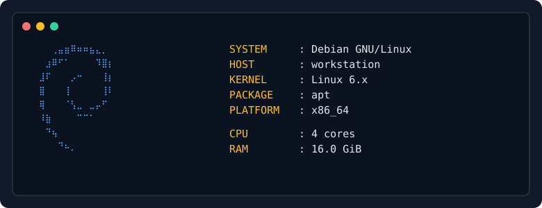

# shfetch

`shfetch` is a small system-information viewer written in POSIX shell. It displays the operating system, host, hardware, desktop, shell and package manager using built-in terminal logos.



## Install

```sh
git clone https://github.com/hotalexnet/shfetch.git
cd shfetch
./install.sh
```

The installer defaults to `~/.local`. To install system-wide:

```sh
PREFIX=/usr/local ./install.sh
```

Logo artwork is stored as one UTF-8 text file per logo under [`logos/`](logos/). To use a different logo directory, set `SHFETCH_LOGO_DIR`.

## Usage

```text
shfetch [options]
  -l, --logo NAME   use a specific logo
  -p, --plain       print without ANSI cursor controls
      --version     print version
      --list-logos  list supported logo names
  -h, --help        show help
```

Plain mode is selected automatically when stdout is not a terminal, when `TERM=dumb`, or when the terminal is narrower than 70 columns. Long values are truncated to keep the layout aligned.

Built-in logos include Alpine, Arch, Artix, CachyOS, Debian, Fedora, FreeBSD, Kali, Linux Mint, macOS, NetBSD, OpenBSD, openSUSE, Ubuntu, Void, Windows and others. Run `./main.sh --list-logos` for the complete list.

## Compatibility

Linux is fully supported, including common distributions and Android environments. macOS and BSD provide best-effort generic system information where `sysctl` is available. Windows is not supported when running a native Windows shell; use WSL for Linux support.

The script has no runtime dependencies beyond standard POSIX tools. `lscpu`, `lspci`, `hostnamectl` and distribution package-manager commands are optional.

## Development

Run the local checks with:

```sh
sh tests/test_main.sh
```

The GitHub Actions workflow runs syntax checks, ShellCheck and the same smoke tests on every push and pull request.

## License

BSD 2-Clause. See [LICENSE](LICENSE).
